# 💵 Clothing Shop - Assigment PRJ301 - JAVA WEB APPLICATION DEVELOPMENT SU24

## You will find in this repo the following stuff:

- The Java web source used to develop flower e-commerce shopping
- Register an account with your username and password
- Login with registered account or quickly with google account
- Automatically send email after checkout cart
- Automatically send email Subscribe receive news letters
- Authorizing client, user, admin by filter
- Custom tag for showing all products in cart
- Add to cart don't reload page by using axios
- Design pattern MVC2 Model
- Paging or load more products don't reload page by using ajax
- ...

---

## Table of Contents 📒

- [Description](#description)

- [Preview Screenshot](#preview-screenshot)

- [Technology](#technology)

- [Functional requirements](#functional-requirements)

<!-- - [Reference](#reference)

- [License & Copyright](#license--copyright) -->

---

## Description 📋

- This web application is out assignment under the requirement of teacher in class
- This is a website for guest and user for buying clothes
- This website also contains a function for admin for managing
- This web works well on desktop.

---

## Preview Screenshot 📷

**1. Guest:** 
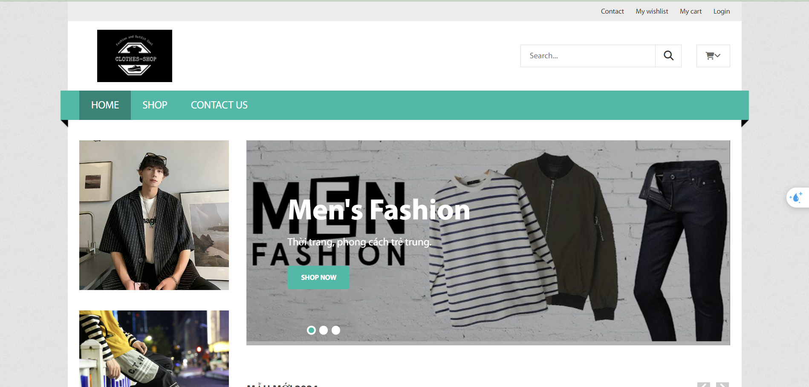&nbsp;
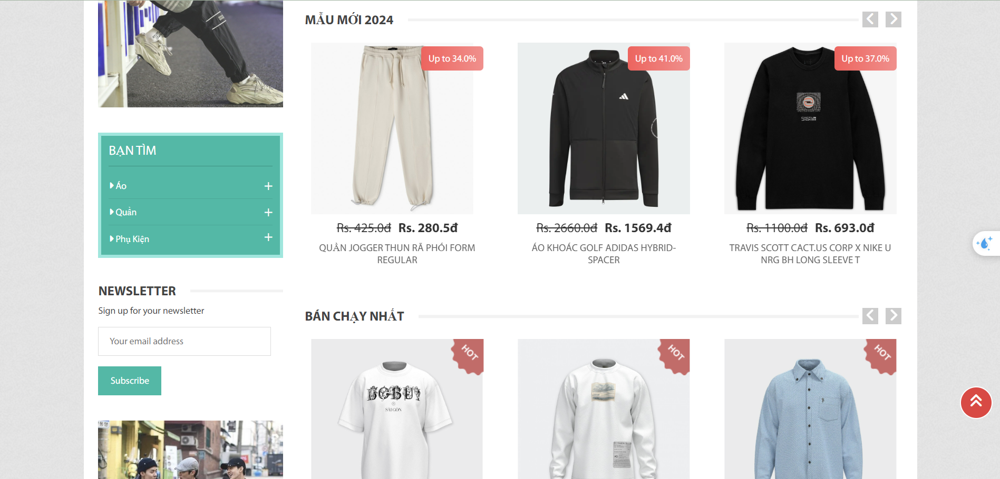&nbsp;
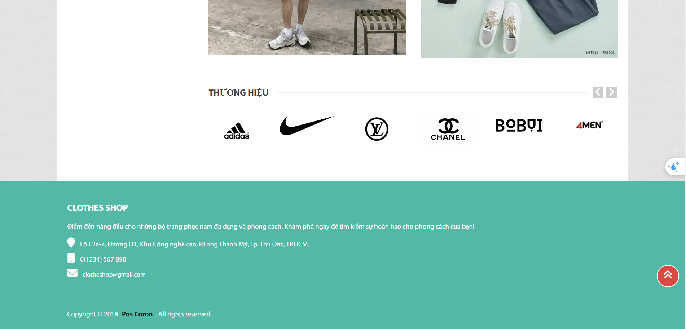&nbsp;
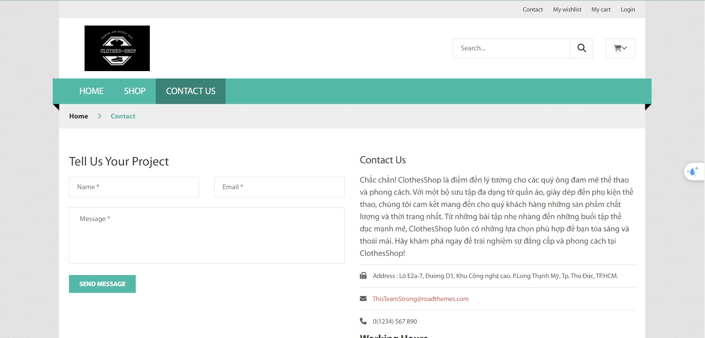&nbsp;
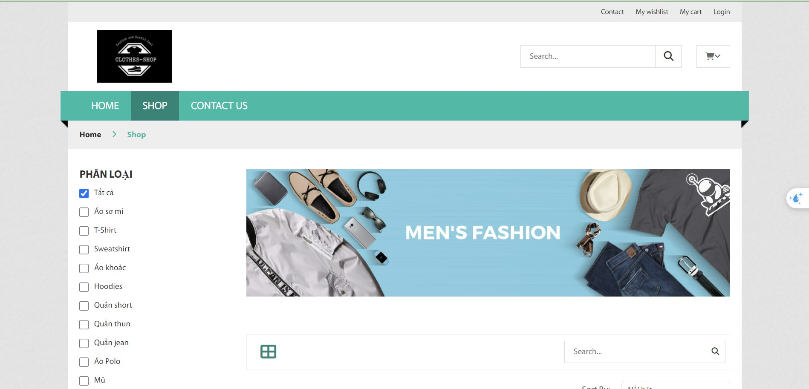&nbsp;
&nbsp; 
**2. User** 
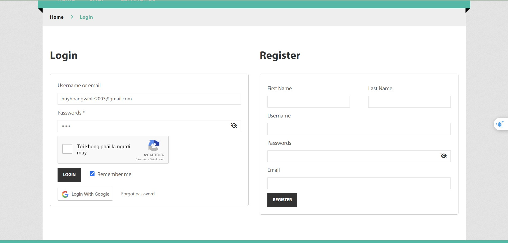&nbsp;
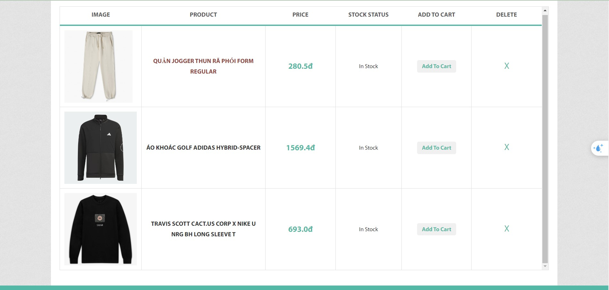&nbsp;
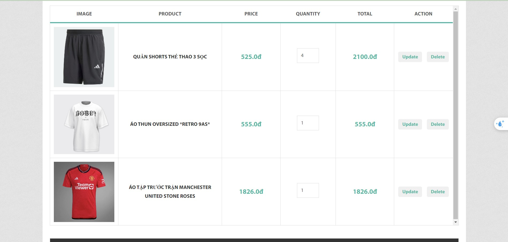&nbsp;
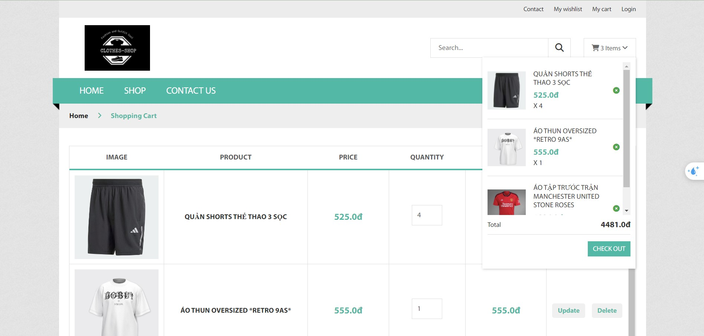&nbsp;
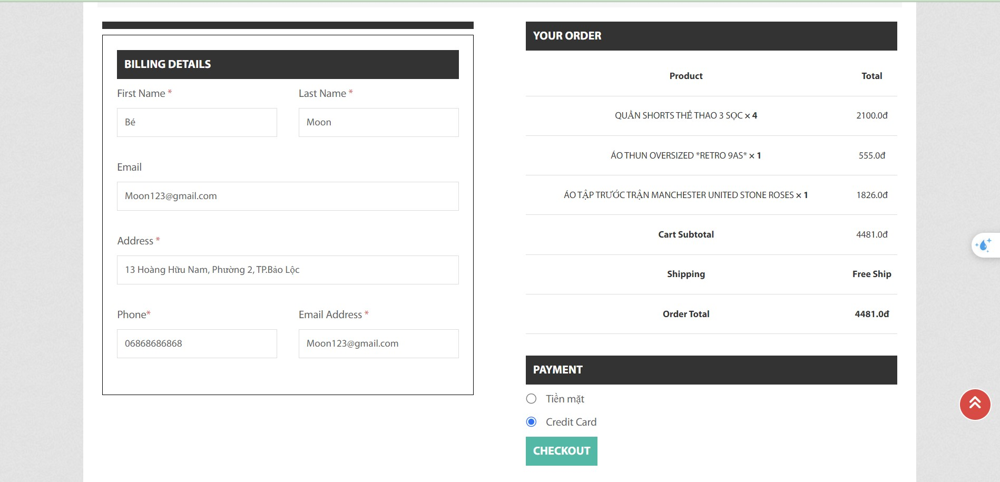&nbsp;
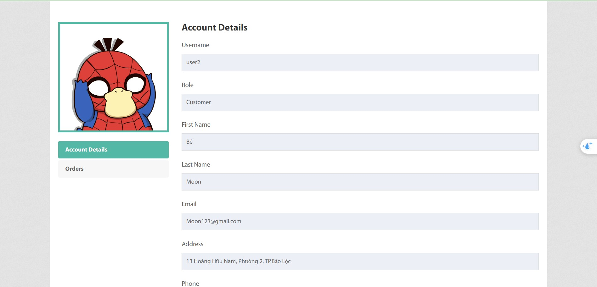&nbsp; 
**3. Admin:** 
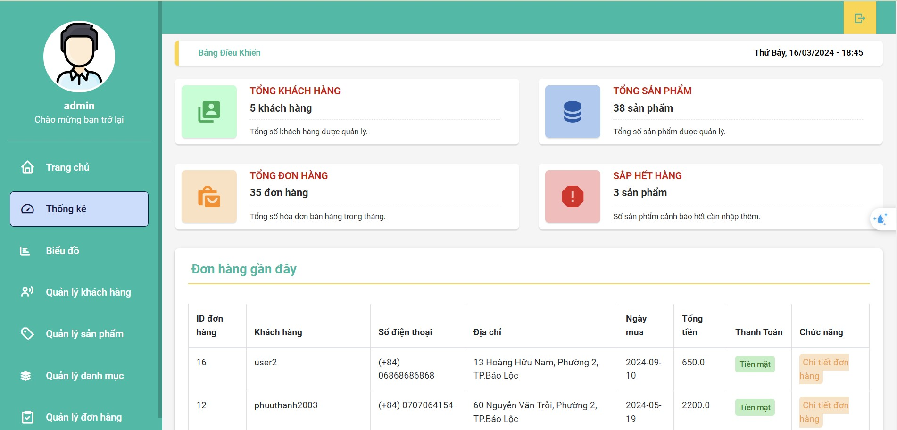&nbsp;
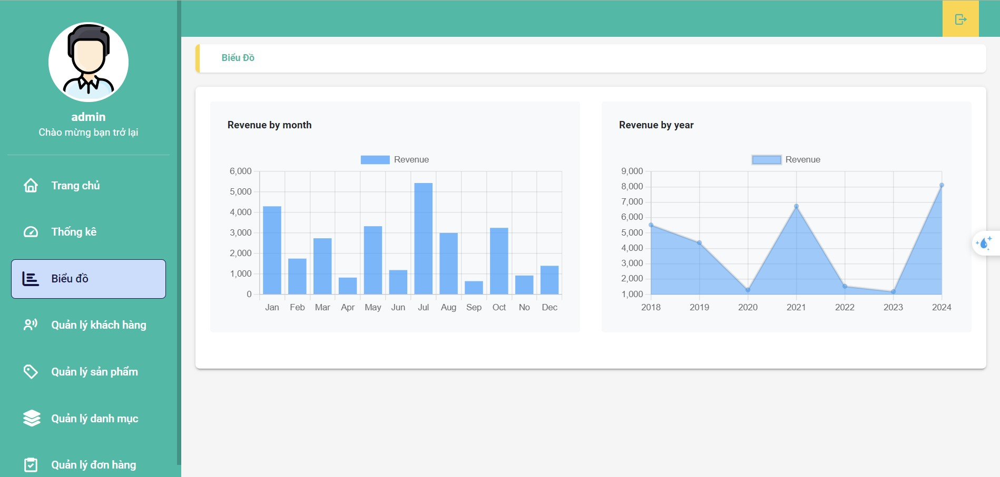&nbsp;
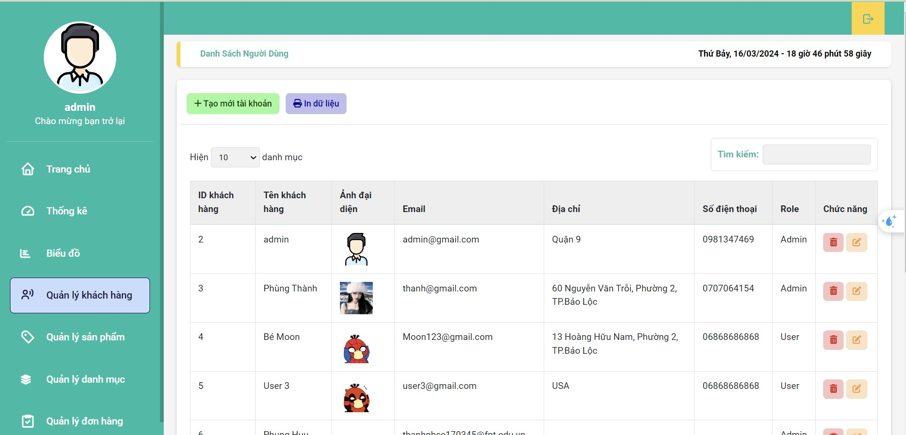&nbsp;
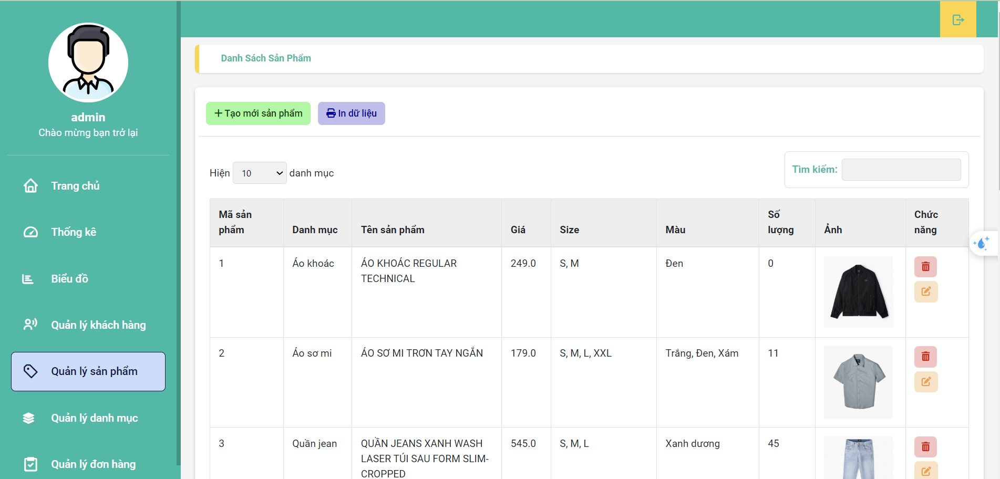&nbsp;
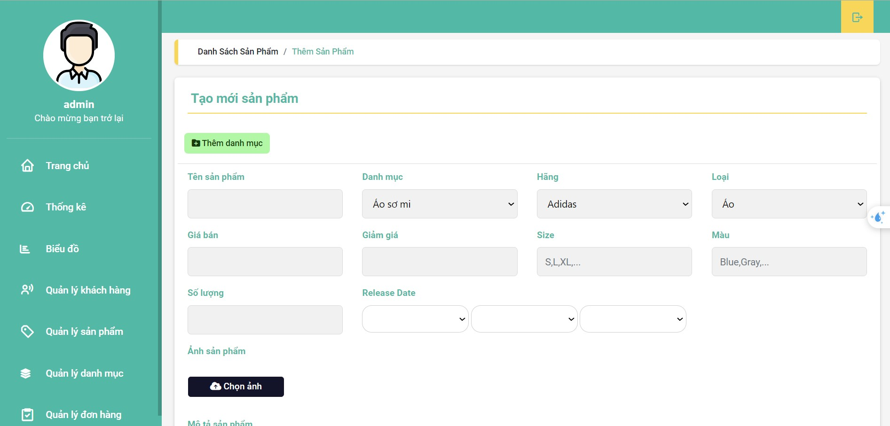&nbsp;
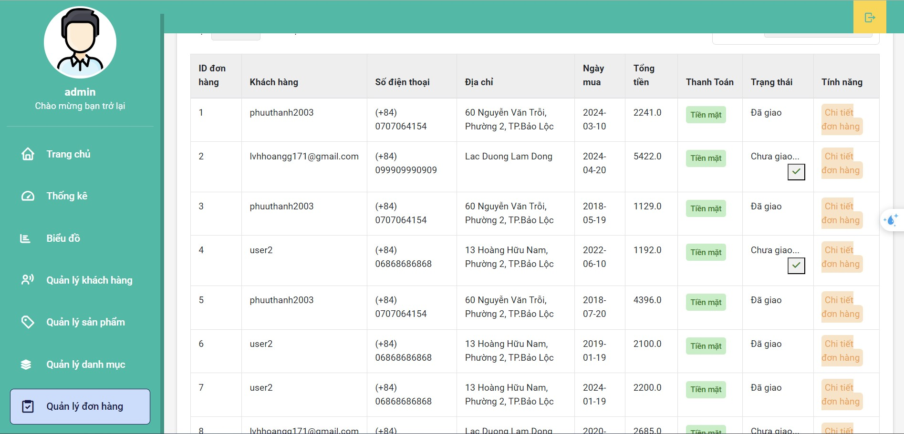&nbsp;

---

## Technology 🔧

**1. Frontend**

- &nbsp;&nbsp;&nbsp;&nbsp;
- JSP - JavaServer Pages
- JSTL - JSP Standard Tag Library
- Ajax - Asynchronous JavaScript And XML
- ...

**2. Backend**

- Servlets - a Java programming language class that is used to extend the capabilities of servers that host applications accessed by means of a request-response programming model
- JDBC - Java Database Connectivity - a Java API to connect and execute the query with the database

**3. Database**

-  - a relational model database server produced by Microsoft

---

## Functional requirements 📌

**1. Guest:**

- [x] Login by account
- [x] Register an account
- [x] Search, view product
- [x] Filter products
- [x] Add, update, remove cart
- [x] Login by google account

**2. User**

- [x] Search, view product
- [x] Add, update, remove cart
- [x] Subscribe received new daily information
- [x] Logout
- [x] Update account information
- [x] Password retrieval
- [x] View, manage orders
- [x] Checkout

**3. Admin:**

- [x] Managing product
- [x] Managing accounts
- [x] Managing categories
- [x] View order detail
- [x] Send email
- [x] Update admin account information
- [x] Statistic revenue
- [x] Order confirmation

**4. Other Technologies**

- Design pattern: MVC2
- Oauth2

**5. Tool**

- Netbeans 8.2
- Java JDK 8
- Apache Tomcat 8
- Visual Studio Code
- Microsoft SQL Server Management Studio 19
  **6.Libraries**

- JSTL
- sqljdbc4
- javax.mail

---

## Contributors 😎

---

<!-- ## Reference

## License & Copyright

&copy; 2024 Phung Huu Thanh Licensed under the [Apache License 2.0](https://github.com/phuuthanh2003/PerfumeShop/blob/main/LICENSE). -->

> 💁 Feel free to use my repository and star it if you find something interesting 🤘
